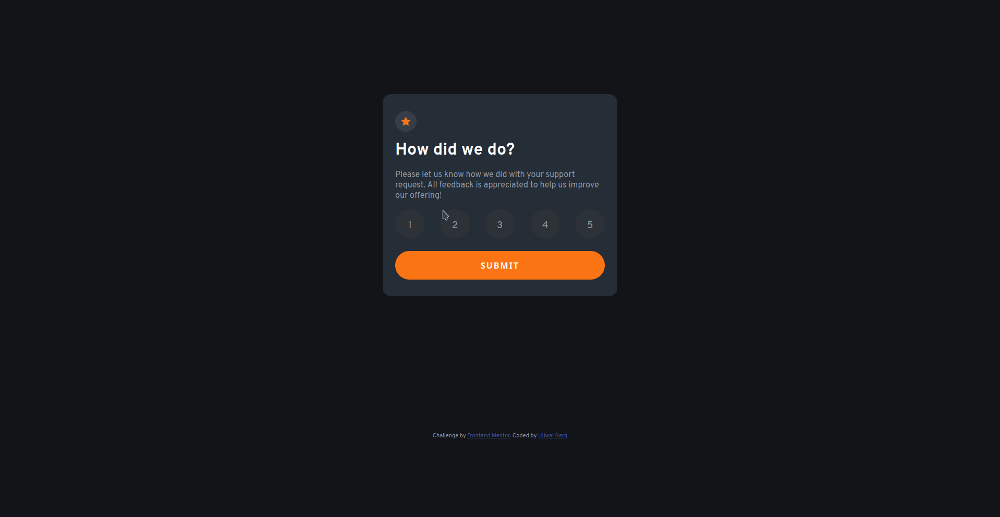

# Frontend Mentor - Interactive rating component solution

This is a solution to the [Interactive rating component challenge on Frontend Mentor](https://www.frontendmentor.io/challenges/interactive-rating-component-koxpeBUmI). Frontend Mentor challenges help you improve your coding skills by building realistic projects.

## Table of contents

-   [Frontend Mentor - Interactive rating component solution](#frontend-mentor---interactive-rating-component-solution)
    -   [Table of contents](#table-of-contents)
    -   [Overview](#overview)
        -   [The challenge](#the-challenge)
        -   [Screenshot](#screenshot)
            -   [Desktop Design](#desktop-design)
            -   [Mobile Design](#mobile-design)
        -   [Links](#links)
    -   [My process](#my-process)
        -   [Built with](#built-with)
    -   [Author](#author)

## Overview

### The challenge

Users should be able to:

-   View the optimal layout for the app depending on their device's screen size
-   See hover states for all interactive elements on the page
-   Select and submit a number rating
-   See the "Thank you" card state after submitting a rating

### Screenshot

#### Desktop Design

  

#### Mobile Design

	 

### Links

-   Solution URL: [https://github.com/gargujjwal/Frontend-Mentors-Interactive-rating-component-solution](https://github.com/gargujjwal/Frontend-Mentors-Interactive-rating-component-solution)
-   Live Site URL: [https://gargujjwal.github.io/Frontend-Mentors-Interactive-rating-component-solution](https://gargujjwal.github.io/Frontend-Mentors-Interactive-rating-component-solution)

## My process

### Built with

-   [![CSS3][css3-shield]][css3-url]
-   [![JavaScript][js-sheild]][javascript-url]

## Author

-   Website - [Ujjwal Garg](https://github.com/gargujjwal)
-   Frontend Mentor - [@gargujjwal](https://www.frontendmentor.io/profile/gargujjwal)
-   Instagram - [@gargujjwal](https://www.instagram.com/gargujjwal/)
-   Linkedin - [@gargujjwal](https://www.linkedin.com/in/ujjwal-garg-3a5639243/)
-   Twitter -[@UjwalGarg100204](https://twitter.com/UjwalGarg100204)

<!-- MARKDOWN LINKS & IMAGES -->
<!-- https://www.markdownguide.org/basic-syntax/#reference-style-links -->

[css3-shield]: https://img.shields.io/badge/CSS3-1572B6?style=for-the-badge&logo=css3&logoColor=white
[css3-url]: https://www.tutorialspoint.com/css/css3_tutorial.htm
[js-sheild]: https://img.shields.io/badge/JavaScript-F7DF1E?style=for-the-badge&logo=javascript&logoColor=black
[javascript-url]: https://developer.mozilla.org/en-US/docs/Web/JavaScript
